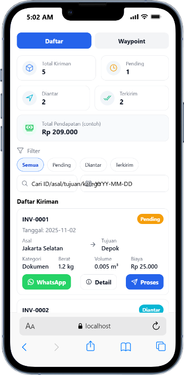
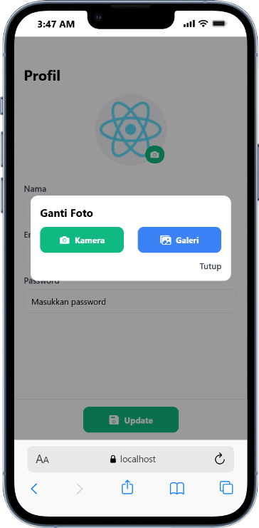
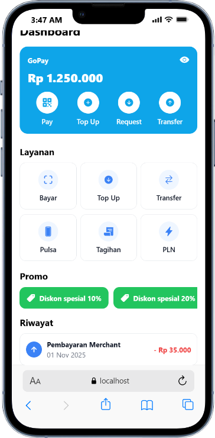

# Expo Basic — Belajar UI, Form Wizard, dan Peta (Leaflet)

Proyek ini adalah latihan membangun antarmuka ala aplikasi sehari‑hari menggunakan Expo (React Native untuk Web). Materi mencakup form multi‑langkah, integrasi peta (Leaflet + OpenStreetMap), geocoding (Nominatim), perhitungan jarak (Haversine), routing jalan (OSRM), real‑time tracking perangkat, animasi follow route, serta dashboard kurir dengan rute waypoint (mirip Traveling Salesman Problem menggunakan OSRM Trip).

## Prasyarat

- Node.js LTS dan npm terpasang
- Git (opsional)
- Koneksi internet (untuk memuat CDN Leaflet, Nominatim, dan OSRM)

## Menjalankan Proyek

1. Install dependensi (jalankan sekali):
   ```bash
   npm install
   ```
2. Jalankan Expo untuk Web (disarankan port 8083):
   ```bash
   npx expo start --web --port 8083
   ```
3. Buka browser di `http://localhost:8083/`.
4. Navigasi dari tab “Fragment” untuk membuka halaman‑halaman yang disediakan.

## Struktur Proyek Singkat

- `app/(tabs)/fragment.tsx` — halaman berisi kartu navigasi ke contoh‑contoh
- `app/pages/layout-stack/gojek-order.tsx` — halaman order ala Gojek dengan peta full‑screen
- `app/pages/layout-stack/order-kirim.tsx` — form wizard 3 langkah untuk pengiriman barang
- `app/pages/layout-stack/dashboard-kurir.tsx` — dashboard kurir: daftar tugas + segment “Waypoint (TSP)”
- `app/pages/layout-stack/dashboard-tokopedia.tsx` — halaman contoh e‑commerce (opsional)

## Langkah Pembelajaran (Step‑by‑Step)

1. Setup proyek Expo untuk Web
   - Menjalankan `npx expo start --web` dan memahami struktur `app/`.
2. Membuat halaman dasar dan navigasi
   - Menambahkan kartu di `Fragment` untuk mengakses contoh halaman.
3. Gojek Order Page — layout dasar
   - Menempatkan form pickup/destination dan estimasi di bottom‑sheet tetap.
   - Peta Leaflet sebagai latar full‑screen.
4. Integrasi Peta & Geocoding
   - Memuat Leaflet via CDN, menambahkan marker draggable.
   - Reverse geocoding: saat marker dipindah/posisi berubah, alamat otomatis diperbarui dari koordinat.
   - Geocoding alamat (Nominatim) untuk mengonversi alamat → koordinat dan autocomplete destinasi (minimal 5 huruf agar hemat request).
   - Routing jalan: polyline mengikuti jalan menggunakan OSRM Route; tersedia tombol fokus rute.
5. Perhitungan Jarak dan Estimasi
   - Menggunakan Haversine untuk menghitung jarak km.
   - Menghitung estimasi biaya berdasar jarak.
6. Form Wizard Kirim Barang (3 Langkah)
   - Langkah 1: asal, tujuan, kategori item.
   - Langkah 2: bobot nyata dan dimensi (p x l x t) satu baris, volume dihitung otomatis.
   - Langkah 3: konfirmasi dan ringkasan biaya.
7. Dashboard Kurir — Daftar Tugas
   - Kartu berisi resi, alamat, tombol WhatsApp, dan tombol Maps untuk rute.
8. Dashboard Kurir — Waypoint (TSP)
   - Segment toggle “Daftar” vs “Waypoint”.
   - Menghitung rute gabungan waypoint menggunakan OSRM Trip (source=first, destination=last, roundtrip=false).
   - Fallback rute jalan per segmen: bila geometry Trip tidak tersedia, setiap leg antar titik dihitung via OSRM Route dan digabung, sehingga polyline tetap mengikuti jalan.
   - Fallback terakhir: bila panggilan OSRM untuk suatu segmen gagal, segmen itu ditarik lurus sementara segmen lain tetap mengikuti jalan.
9. Review & Verifikasi
   - Buka `http://localhost:8083/` dan uji tiap halaman.
   - Periksa konsol browser; beberapa error jaringan OSRM/Nominatim bisa muncul namun UI tetap berfungsi berkat fallback.

## Fitur Utama per Halaman

- Gojek Order (`gojek-order.tsx`)
  - Form tetap di bottom sheet; peta background full‑screen.
  - Marker pickup/destination draggable dan sinkron dengan form.
  - Reverse geocoding: alamat ditampilkan kembali dari koordinat saat marker dipindah atau posisi perangkat diperbarui.
  - Autocomplete destinasi Nominatim (minimal 5 huruf untuk menampilkan saran).
  - Routing jalan via OSRM Route: polyline mengikuti jalan; tersedia tombol fokus rute.
  - Estimasi jarak/biaya via Haversine untuk perhitungan cepat.
  - Tracking realtime: tombol “Tracking: ON/OFF” memantau posisi perangkat dan kamera mengikuti.
  - Follow Route: tombol “Follow Route: ON/OFF” menggerakkan marker kecil sepanjang polyline dan kamera mengikuti; otomatis menonaktifkan Tracking saat aktif (dan sebaliknya) agar tidak bentrok.

- Wizard Kirim Barang (`order-kirim.tsx`)
  - Tiga langkah: asal/tujuan/kategori → bobot + dimensi (p,l,t) → konfirmasi.
  - Volume dihitung otomatis dari dimensi; biaya contoh dihitung dari bobot dan volume.

- Dashboard Kurir (`dashboard-kurir.tsx`)
  - Segment “Daftar”: list tugas, tombol WhatsApp dan modal peta rute per tugas.
  - Segment “Waypoint”: peta rute gabungan (mirip TSP) + urutan kunjungan.
  - Polyline mengikuti jalan: prioritas geometry OSRM Trip; bila tidak ada, dibangun dari OSRM Route per segmen secara berurutan.
  - Fallback: segmen yang gagal panggilan OSRM sementara ditarik lurus, segmen lain tetap mengikuti jalan.
  - Tracking realtime: tombol “Tracking: ON/OFF” memantau posisi perangkat, menampilkan marker biru, dan kamera mengikuti.
  - Follow Route: tombol “Follow Route: ON/OFF” menggerakkan marker kecil di sepanjang polyline dan kamera mengikuti; aktifnya Follow Route mematikan Tracking otomatis.

## Catatan Teknis

- Leaflet hanya diaktifkan pada platform Web dan dimuat via CDN.
- Nominatim/OSRM adalah layanan publik; rate‑limit atau kegagalan jaringan bisa terjadi.
  - Implementasi memiliki fallback berlapis: (1) rute per segmen via OSRM Route bila geometry Trip tidak tersedia, (2) garis lurus per segmen bila panggilan OSRM gagal.
  - Autocomplete destinasi dibatasi minimal 5 huruf untuk mengurangi beban request; reverse geocoding diberi throttle agar hemat.
- Geolocation membutuhkan izin browser; ada fallback ke Jakarta bila ditolak.
  - Saat Tracking aktif, Follow Route dimatikan otomatis (dan sebaliknya) agar kamera tidak “berebut”.

## Cara Uji Cepat

- Buka `http://localhost:8083/` dari browser.
- Gojek Order:
  - Geser marker untuk melihat alamat otomatis (reverse geocoding) dan jarak Haversine.
  - Ketik destinasi ≥ 5 huruf untuk melihat saran autocomplete; pilih satu untuk menggambar rute jalan OSRM.
  - Coba “Follow Route: ON” untuk animasi mengikuti rute; “Tracking: ON” untuk mengikuti posisi perangkat (aktif salah satu saja).
- Dashboard Kurir → Waypoint:
  - Tekan “Hitung Ulang” untuk membentuk rute; periksa apakah polyline mengikuti jalan.
  - Matikan/nyalakan “Follow Route” dan “Tracking” untuk mencoba perilaku kamera/marker.
- Geolocation membutuhkan izin browser; ada fallback ke Jakarta bila ditolak.

## Screenshot

Semua gambar berada di folder `screenshoot/` dan disematkan di bawah ini:

### Gojek / Pengantaran


### Wizard Kirim Barang


### Dashboard Kurir




### Lainnya





## Pengembangan Lanjutan (Ide)

- Wizard Kirim Barang: pilihan satuan (cm/inch, kg/lb) dan validasi batas nilai.
- Dashboard Kurir:
  - Opsi `roundtrip=true` untuk kembali ke titik awal
  - Menampilkan jarak total, estimasi waktu OSRM, dan biaya akumulatif
  - Warna polyline per segmen (mis. hijau/kuning/merah berdasarkan estimasi durasi)
  - Simpan rute dan buka navigasi Google Maps dengan waypoint
- Gojek Order:
  - Pengaturan kecepatan animasi Follow Route dan zoom konstan
  - Menampilkan estimasi waktu/jarak OSRM di panel estimasi

Selamat belajar dan bereksperimen!